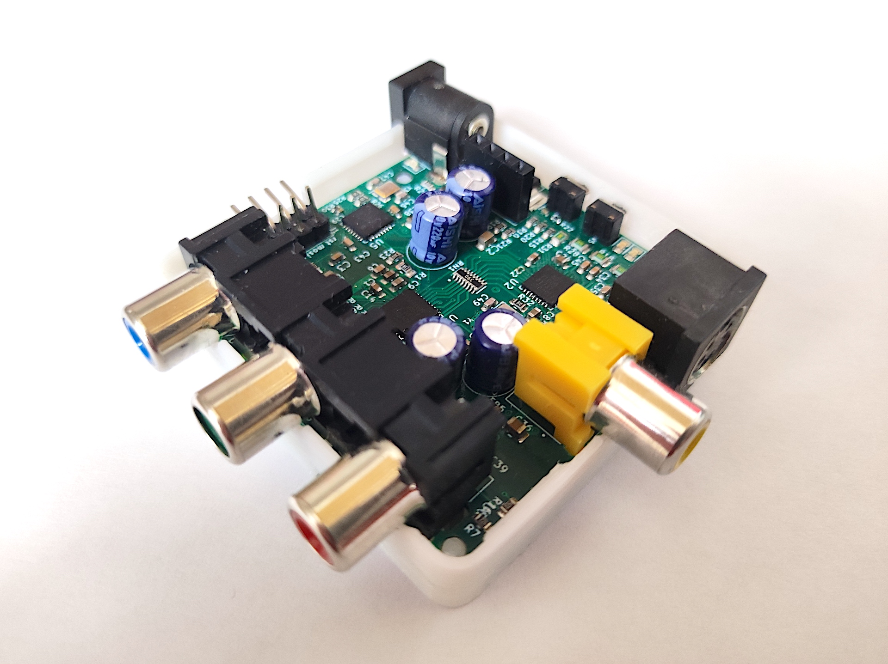

# C2C-64
A Composite & S-Video to Component Video transcoder to feed older analog signals into your OSSC.

Designed with the C-64 in mind, it also supports composite and s-video signals from other systems, including the N64. A compatibility chart will soon be available in the wiki section of this project.

## Description

This is an open hardware implementation of a board to convert Composite and S-Video signals into Component video. The component output from C2C-64 can be directly connected to an OSSC, effectively adding compatibility with Composite and S-Video input to this great scaler.

C2C-64 was primarily design as a simple way to connect a C64 to and OSSC. Most of the testing has been done in this platform, and presets have been chosen with it in mind. I have conducted some tests with other machines (N64, SNES, Dreamcast), although not as extensive.

C2C-64 uses a simple pipeline of video decoder and encoder to transform the input composite or S-video signals into component video. What this means in practice is that the analog input is converted to digital format and fed to the encoder to transform it into a different analog signal. This conversion is NOT lossless. However, it enables anyone to conveniently hook such signals directly into the OSSC without tinkering with the internals of their devices. 

## Getting your C2C-64

This is an open project, in this repository you will find everything you need in order to build your own C2C-64.

It is important to note that building this requires ninja-grade soldering skills, especially to get those QFN ICs properly connected to the board. Also, sourcing some of the components may be a bit trickier than usual. In particular, the ADV7180 IC is unsupported by Analog anymore and probably AliExpress is the only place where it can be found at this point. There is an ADV7280(A) based version of the C2C (2R) that will be soon released, but the price of this IC is way more expensive.

I am in the process of building a first batch of 35 boards (version 1R3) that I will be selling to anyone interested in supporting the project. Reach me directly if you are interested (DM me directly through [twitter](https://twitter.com/jsanpe))

You can also support the project by donating through my KoFi page
 

## Comparison to Koryuu

In terms of functionality, C2C-64 provides a similar experience to the commercial product [Koryuu](https://videogameperfection.com/products/koryuu-transcoder/). However, there are notable differences between C2C-64 and Koryuu:
- C2C-64 is fully Open and Free, both Software and Hardware. Note, C2C-64 is still WiP so some parts are either missing or still in beta.
- C2C-64 has been designed to be as affordable as possible. The PCB is a 50x50mm 4 layer design, for which you can normally get special deals on PCB manufacturers. With the current shortage of electronic parts, it is difficult to estimate the total BOM cost given the huge price fluctuations. It should be possible to get the board built for well under $50 in small amounts even in these adverse conditions (half the price of Koryuu).
- The video decoding IC in the C2C-64 is the older Adv7180, compared to the more modern Adv7280 of the Koryuu. I made extensive tests, and for the intent and purposes of this board I don't think the extra cost of Adv7280 (5x the price of Adv7180) is justified. This assumption holds as long as you connect the output to an OSSC, which has de-interlacing and scaling options way beyond the possibilities of the Adv7280. An Adv7280-based version of C2C-64  already exists and will be released at some point in the future (it needs more testing and firmware changes)
- C2C-64 adds a big number of usability features to the mix (described below) making it way more flexible in terms of configuration options

## User interface

One important improvement of C2C-64 over Koryuu is the inclusion of powerful interfacing options. The board provides three main ways of allowing user interaction:
- Side switches: There are 3 switches that allow the user to perform the two most common actions: alternating the source video signal between composite and S-video; and selecting configuration profiles stored in the board EEPROM.
- UART connection: A computer can be hooked up to the board using the uart pin headers available for this purpose. Using a VT100 compatible terminal, users can configure tenths of parameters about how the video decoding/encoding is performed using menus. Such settings can then be stored as profiles in the EEPROM to be easily accessed using the side switches.
- OLED Screen: The board supports the connection of an OPTIONAL 0.96'' oled display. When the board detected that an OLED display has been connected, it will show a reduced version of the menu system offered through the UART connection, making the use of a computer to configure settings completely unnecessary.

There are also 4 leds that are used to show important signals about the operation of the board

## Important notice

This project is still WiP. The repository contains only a beta version of the firmware required to run the board. Keep checking this page for updates.
